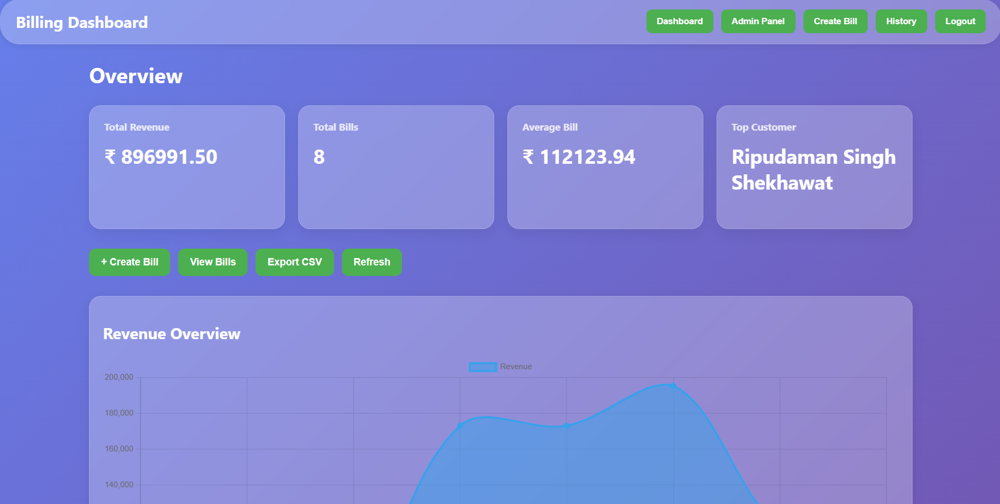

# Billing Software Backend

<p align="center">
  
</p>

<p align="center">
  <strong>Modern • Secure • Fast • Scalable</strong>
</p>

<p align="center">
  
  
  
  
  
</p>

---

## 📸 Preview

<p align="center">
  
</p>

---

## ✨ Features

* 🔐 JWT Authentication
* 📦 Product & Inventory Management
* 👤 Customer Management(Coming Soon.)
* 🧾 Invoice Generation
* 💳 Payment Tracking
* 📊 Dashboard Analytics
* 📄 PDF Invoice Export
* 🔍 Advanced Search
* 🛡️ Role-Based Access
* ⚡ RESTful API

---

## 🏗️ Tech Stack

| Layer          | Technology |
| -------------- | ---------- |
| Backend        | FastAPI    |
| Database       | SUPABASE   |
| ORM            | SQLAlchemy |
| Authentication | JWT        |
| Validation     | Pydantic   |
| Server         | Uvicorn    |

---

## 📂 Project Structure

```text
BILLING_SOFTWARE_BACKEND/
 ├── api/
 ├── auth/
 ├── models/
 ├── schemas/
 ├── services/
 ├── database/
 ├── utils/
 └── main.py
```

---

## 🚀 Quick Start

```bash
git clone https://github.com/ripudamanss/BILLING_SOFTWARE_BACKEND.git

cd BILLING_SOFTWARE_BACKEND.git

pip install -r requirements.txt

uvicorn app.main:app --reload
```

---

## 📖 API Documentation

| URL      | Description |
| -------- | ----------- |
| `/docs`  | Swagger UI  |
| `/redoc` | ReDoc       |

---

## ⭐ Support

If you like this project, consider giving it a star ⭐.

<p align="center">
Made with ❤️ by <b>Ripudaman Singh</b>
</p>
