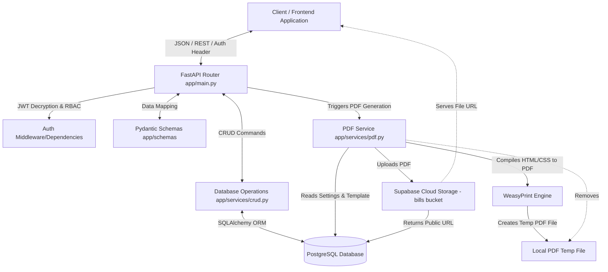
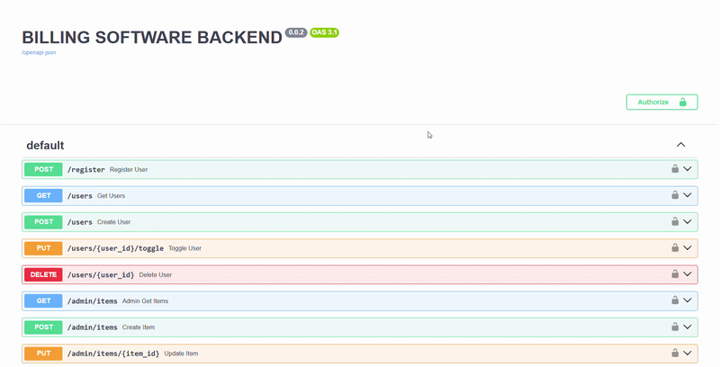

# 🧾 Billing Software Backend

<p align="center">
  
</p>

<p align="center">
  <strong>Fast • Secure • Scalable • Automating Business Invoicing</strong>
</p>

<p align="center">
  <a href="https://github.com/ripudamanss/BILLING_SOFTWARE_BACKEND/blob/main/LICENSE">
    
  </a>
  <a href="https://fastapi.tiangolo.com/">
    
  </a>
  <a href="https://supabase.com/">
    
  </a>
  <a href="https://www.postgresql.org/">
    
  </a>
</p>

---

## 📖 Table of Contents

1. [Features](#-features)
2. [Tech Stack](#-tech-stack)
3. [Architecture](#-architecture)
4. [Environment Variables](#-environment-variables)
5. [API Routes](#-api-routes)
6. [Getting Started](#-getting-started)
7. [Deployment](#-deployment)
8. [Screenshots & Preview](#-screenshots--preview)
9. [Contribution Guide](#-contribution-guide)
10. [License](#-license)

---

## ✨ Features

- 🔐 **Secure JWT Authentication**: Role-based access control (RBAC) with `admin` and `staff` privilege layers.
- 📦 **Smart Inventory Memory**: Automatic registration of new products and items to memory tables during invoice generation.
- 👤 **Smart Customer CRM**: Automatically builds customer registries from invoice details.
- 🧾 **Robust Invoice Management**: Complete CRUD operations for invoices and itemized line items.
- 📄 **Dynamic PDF Export**: Renders beautiful, A4 print-ready PDFs using **WeasyPrint** (HTML+CSS to PDF engine).
- ☁️ **Permanent Storage integration**: Automatically uploads generated PDFs to Supabase Cloud Storage.
- ⚙️ **Company & Banking Settings**: Admin panel to customize company details, logo settings, terms, and bank accounts dynamically printed on invoice PDFs.

---

## 🛠️ Tech Stack

| Layer | Component | Technology | Description |
|---|---|---|---|
| **API Layer** | Framework | **FastAPI** | Fast, high-performance web framework for Python 3.10+ |
| **Server** | ASGI Server | **Uvicorn** | Lightning-fast ASGI server implementation |
| **Database** | Database Engine | **PostgreSQL** | Relational Database managed through SQLAlchemy |
| | ORM | **SQLAlchemy** | SQL Toolkit and Object-Relational Mapper |
| **Storage** | Object Storage | **Supabase Bucket** | Permanent storage for generated invoice PDFs |
| **Security** | Authentication | **python-jose & bcrypt** | JWT token management & hashed password encryption |
| **Rendering** | PDF Engine | **WeasyPrint** | Visual HTML-to-PDF rendering engine |

---

## 🏗️ Architecture

The backend follows a modular layered architecture, splitting concerns between routing, schema validation, database persistence, and external service clients.



### Components Breakdown
1. **API Router (`app/main.py`)**: Defines route path entrypoints, CORS settings, dependencies injections (`get_db`, `get_current_user`, `require_admin`).
2. **Database Models (`app/models/models.py`)**: Schema mappings representing database tables (`users`, `bills`, `bill_items`, `items`, `settings`, `customers`).
3. **Pydantic Schemas (`app/schemas/schemas.py`)**: Enforces validation constraints on incoming payloads and serializes responses.
4. **CRUD Actions (`app/services/crud.py`)**: Interacts directly with database models and implements "Smart Memory" triggers to register new clients and items automatically.
5. **PDF Generator (`app/services/pdf.py`)**: Formats billing and bank settings into a customized HTML/CSS invoice page, compiles it via WeasyPrint, and uploads it to Supabase Storage.

---

## 🔑 Environment Variables

To run the application, create a `.env` file in the root directory and configure the following variables:

| Variable Name | Type | Description | Example |
|---|---|---|---|
| `SECRET_KEY` | String | Secret key used to sign and verify JWT access tokens | `your-super-secret-random-key` |
| `DB_USER` | String | PostgreSQL database username | `postgres` |
| `DB_PASSWORD` | String | PostgreSQL database password | `your_secure_password` |
| `DB_HOST` | String | PostgreSQL host address | `localhost` or `db.example.com` |
| `DB_PORT` | Integer | PostgreSQL port number | `5432` |
| `DB_NAME` | String | Name of the database | `billing_db` |
| `SUPABASE_URL` | String | Supabase Project URL | `https://xxxx.supabase.co` |
| `SUPABASE_KEY` | String | Supabase API/Service Role Key with storage write capability | `eyJhbGciOi...` |

---

## 🛣️ API Routes

All authenticated routes require a `Bearer <JWT_TOKEN>` authorization header.

### 🔓 Public / Auth Endpoints
* `POST /login` - Log in users, returns access token, token expiration, and assigned role.
  - **Payload:** `schemas.UserLogin` (username, password)
* `POST /register` - Register a new user. 
  - **Privilege:** 🔴 Admin Only (`require_admin` check)
  - **Payload:** `schemas.UserCreate` (username, password, role)

---

### 🟢 Staff / User Endpoints (Requires standard login)

#### 🧾 Bills & Invoices
* `POST /bills` - Create a new bill invoice. Automatically updates/creates items and customers in memory if new.
* `GET /bills` - Retrieve list of all bills sorted by ID.
* `GET /bills/{bill_id}` - Retrieve a single bill invoice alongside all its line items.
* `PUT /bills/{bill_id}` - Update bill details and replace line items list.
* `DELETE /bills/{bill_id}` - Remove a bill invoice and all associated line items.
* `GET /bills/{bill_id}/pdf` - Generate and retrieve public PDF invoice URL. Returns cached URL if already compiled and stored.

#### 👥 Customers & Items
* `GET /customers` - Get all saved customers and billing addresses alphabetically.
* `GET /items` - Get all saved inventory items and default pricing alphabetically.

---

### 🔴 Admin-Only Endpoints (Requires Admin role)

#### 👤 User Management
* `GET /users` - Retrieve all users registered on the system.
* `POST /users` - Add a new backend user (staff or admin).
* `PUT /users/{user_id}/toggle` - Enable or disable login access for a user.
* `DELETE /users/{user_id}` - Permanently delete a user account.

#### 📦 Inventory Master Settings
* `GET /admin/items` - Get a detailed list of all system items.
* `POST /admin/items` - Add new item to default list.
* `PUT /admin/items/{item_id}` - Update pricing, unit, or description of an item.
* `DELETE /admin/items/{item_id}` - Remove item from default list.

#### ⚙️ Organization Settings
* `GET /admin/settings` - Retrieve organization details (Name, Bank account details, IFC, Footer message, display toggles).
* `PUT /admin/settings` - Update organization details and PDF print preferences.

---

## 🚀 Getting Started

### Prerequisites
- Python 3.10+
- PostgreSQL Server instance
- Supabase Project with a public bucket created and named `bills`

### 1. System Dependencies for WeasyPrint
WeasyPrint requires certain system libraries for compiling HTML/CSS to PDF:

- **Linux (Debian/Ubuntu):**
  ```bash
  sudo apt-get install build-essential python3-dev libcairo2 libpango-1.0-0 libpangocairo-1.0-0 libgdk-pixbuf2.0-0 libffi-dev shared-mime-info
  ```
- **macOS (via Homebrew):**
  ```bash
  brew install cairo pango gdk-pixbuf libffi
  ```
- **Windows:**
  - Modern WeasyPrint versions include pre-packaged DLLs. If errors occur, install the [GTK3 runtime package](https://github.com/tschoonj/GTK-for-Windows-Runtime-Environment-Installer).

### 2. Setup Guide
1. Clone the repository:
   ```bash
   git clone https://github.com/ripudamanss/BILLING_SOFTWARE_BACKEND.git
   cd BILLING_SOFTWARE_BACKEND
   ```
2. Create and activate virtual environment:
   ```bash
   python -m venv .venv
   # Windows:
   .venv\Scripts\activate
   # Linux/macOS:
   source .venv/bin/activate
   ```
3. Install dependencies:
   ```bash
   pip install -r requirements.txt
   ```
4. Setup environment file:
   - Create a `.env` file in the project root containing your database configs, JWT key, and Supabase credentials.
5. Run the development server:
   ```bash
   uvicorn app.main:app --reload --port 8001
   ```
6. Access interactive API documentation at:
   - Swagger UI: [http://localhost:8001/docs](http://localhost:8001/docs)
   - ReDoc: [http://localhost:8001/redoc](http://localhost:8001/redoc)

---

## ☁️ Deployment

### Render Deployment (Using `render.yaml`)
This repository comes with pre-configured `render.yaml` for one-click setup on Render.

1. Create a Web Service on Render and link this repository.
2. Render will automatically detect `render.yaml` and configure:
   - **Environment:** `python`
   - **Build Command:** `pip install -r requirements.txt`
   - **Start Command:** `uvicorn app.main:app --host 0.0.0.0 --port $PORT`
3. Configure the [Environment Variables](#-environment-variables) inside the Render Dashboard under **Environment**.

### Database & Storage Requirements
1. Ensure your PostgreSQL instance has tables initialized (FastAPI handles table creation on startup, but schemas must be kept in sync).
2. Create a public storage bucket in Supabase called `bills`. Ensure the bucket security policies allow read/write operations for the credentials provided in `SUPABASE_KEY`.

---

## 📸 Screenshots & Preview

### 📽️ GIF Preview
<p align="center">
  
</p>

### 📸 Application Views

Here is a visual walk-through of the interface powered by this backend:

| Dashboard Analytics | Bill Creator Screen |
|:---:|:---:|
|  |  |
| *Visualizes billing analytics, revenues, and sales.* | *Dynamic invoicing tool with autocomplete and auto-save capabilities.* |

| A4 PDF Generated Invoice | User Management Panel |
|:---:|:---:|
|  |  |
| *Print-ready A4 PDF invoice stored on cloud.* | *RBAC user creation, locking, and roles assignments.* |

---

## 🤝 Contribution Guide

Contributions are welcome! Please read through our [Contributing Guidelines](/contributing.md) for details on code style, issue submission, and testing procedures.

> [!IMPORTANT]
> **Approval Process:** Please contact the maintainer at `damanripu8949@gmail.com` before initiating major contributions or pull requests to coordinate development pipelines.

### Development Workflow
1. Fork the project repository.
2. Build a local feature branch: `git checkout -b feature/your-feature-name`
3. Verify formatting aligns with **PEP 8** style guides.
4. Push code changes and submit an explanatory Pull Request.

---

## 📄 License

This project is licensed under the **MIT License** - see the [LICENSE](/contributing.md) file for more information.

Copyright (c) 2026 **Ripudaman Singh Shekhawat**
